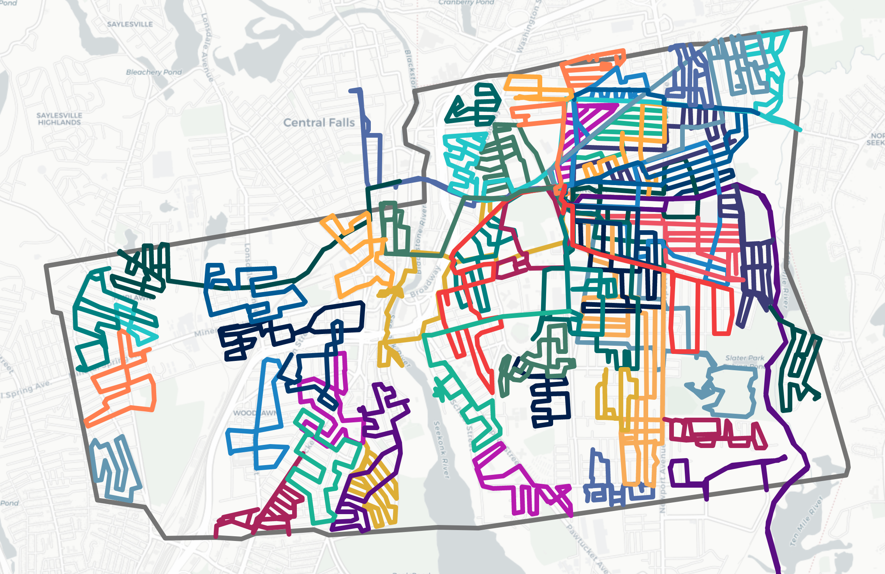

# lifemap

A pretty map for tracking progress towards walking all streets in your town, plus optional location-tracking when you're on a new walk.



## Why:
My wife and I wanted to walk all the streets in our town during the COVID-19 pandemic, so we needed a way to map all the streets we'd already walked. I started this project upon discovering that the [CityStrides](https://citystrides.com/) Lifemap would take weeks to generate (thanks to [Strava not responding](https://community.citystrides.com/t/welcome-to-the-community-roadmap-updated-2020-04-23) to CityStrides' requests to increase their API limits).
Blog post to come

## How it works:
- I track walks in the [Strava](https://www.strava.com/) app
- I run a python script to extract the GPS data for my walks from Strava via their API
- I push the walk data to github and Github Pages renders a static webpage that uses [Leaflet](https://leafletjs.com/) to display the walks and handle location tracking
- On a new walk, I use the Strava app to track the walk in the background and I pull up the static webpage on my phone so I can see my current location superimposed on the map of all previous walks

## Usage:
### Check out the map (using my runs)
A working map populated with my walks: 
- **NOTE:** The page will ask you if you want to share your location.
    - If you say no, the map will still work fine.
    - Location tracking is intended for use on mobile web while walking somewhere within the map area. Still, for the Demo you can share your location and you will see a new blue circle over your location approx. every 10 seconds. If you're not moving, the circles will just pile up on top of each other.
    - Your location is not being saved anywhere as this is a static webpage and you can inspect the HTML to confirm no scripts are sending it anywhere else.

### Render the page on your local machine (using my runs)
1. Clone this repo, then run
```
cd <path_to_cloned_repo>
pipenv install
pipenv run python local_render.py
```
2. visit `127.0.0.1:5001` in your browser

### **Map your own runs:**
1. **Set up Strava API access**
    1. Follow all instructions on this page https://developers.strava.com/docs/getting-started
    2. Copy `.env-sample` into a new file called `.env` and paste in your creds:
    ```
    STRAVA_CLIENT_ID=<your_strava_client_id_here>
    STRAVA_CLIENT_SECRET=<your_strava_client_secret_here>
    ```

    3. Copy `tokens-example.csv` into a new file called `tokens.csv` and populate it with your new tokens:

    ```
    access_token,expires_at,refresh_token
    <your_access_token>,<expires_at>,<your_refresh_token>
    ```
2. **Clone this repo, then run**
    ```
    cd <path_to_cloned_repo>
    pipenv install
    pipenv run python get_strava_activities.py
    ```
    - This should replace `static/walks.js` with your walks instead of mine.
3. **Re-center the map**
- The map is hardcoded to center on Pawtucket, RI when it loads. Change the coordinates of `center` to those of your own town. [This util](https://www.latlong.net/) can help you find coordinates for any town.
    - From [line 29](https://github.com/jumpingboy/lifemap/blob/main/index.html#L29-L35) of `index.html`:
    ```
    var map = L.map('map',
        {
            center: [41.877, -71.383055],
            zoom: 14,
            zoomSnap: 0.2,
            zoomDelta: 0.2 
        })
    ```

4. **Generate the boundary line**
- The grey boundary line is a hardcoded, handmade boundary line for Pawtucket, RI. To make your own boundary line, use the [Google polyline generator](https://developers.google.com/maps/documentation/utilities/polylineutility) and paste the encoded polyline into [line 64](https://github.com/jumpingboy/lifemap/blob/main/index.html#L64) of `index.html`
    ```
    boundaryPolyline = <your_encoded_polyline_here>
    ```

5. **Render the map**
- Run 
```
pipenv run python local_render.py
```
- Then visit `127.0.0.1:5001` in your broswer


### Use a custom style from Mapbox
I made a custom style in Mapbox that "erases" completed streets:


To use this style:
- Create your own (free) [Mapbox account](https://www.mapbox.com/)
- Copy `static/mapboxAccessToken-example.js` to a new file: `static/mapboxAccessToken.js` and enter your Mapbox Access Token into the new file
- Hop into `index.html` at [line 37](https://github.com/jumpingboy/lifemap/blob/main/index.html#L37-L46), comment in the mapbox "Street Delete" style parameters and comment out the "Light map and random colors" parameters:
```
// Light map & random colors
	// var maphost = 'cartodb'
	// var randomColors = true
	// var runWeight = 6

// Street Delete
	var maphost = 'mapbox'
	var tileStyle = 'jumpingboy/ckagz1zea15l11ipjpfyv1e4e'
	var runColor='#EBEBEB'
	var runWeight = 8
```
- Launch the server
```
pipenv run python local_render.py
```
- Then visit `127.0.0.1:5001` in your broswer
